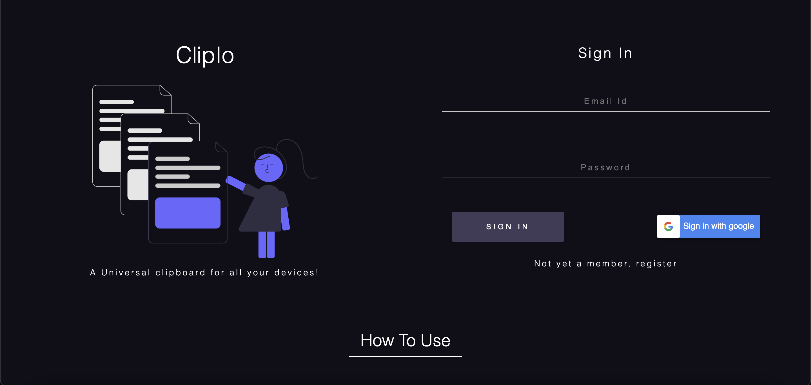
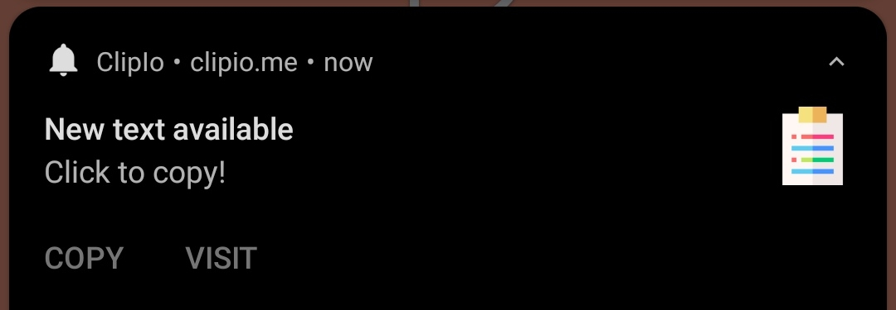

  <h1><a href="https://clipio.me/">📋 ClipIo </a></h1>
  <h3>
    A Universal clipboard for all your devices!
  </h3>
  

  

It's often difficult to move some data from one device to another especially when we have to move something from our mobile device to PC. Here's the solution for you!!. Welcome to <a href="https://clipio.me/"><b>ClipIo</b></a>, the universal clipboard app that instantly transmits data from one device to another without any hassle. All you have to do is just log in with the same account from both of your devices and the app will work as you go. The simpliest user interface will say the rest to you!
  

## Screenshots 👇

### Sign in/up

### Home

### Notifications

### File sending/receiving

## Don't forget to leave a star ⭐ if you like it!

